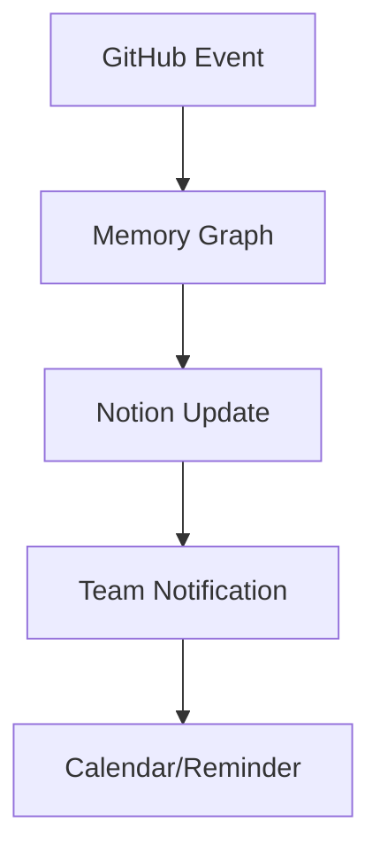

# Toilville Toolset Best Practices

## Overview
This document outlines best practices for utilizing the integrated toolsets in the Toilville ecosystem, specifically focusing on the synergy between GitHub, Notion, Apple ecosystem, and memory graph management.

## Tool Categories

### 1. Development Tools
```json
{
  "primary_focus": "Knowledge Graph Management",
  "best_practices": [
    "Create entities for major project components",
    "Maintain relationships between related features",
    "Document technical decisions in observations",
    "Use graph queries for dependency tracking"
  ]
}
```

#### Implementation Guidelines
- Create entities for:
  - Feature modules
  - Architecture decisions
  - Technical dependencies
  - Team responsibilities
- Use relations to map:
  - Feature dependencies
  - Component interactions
  - Team assignments
  - Project milestones

### 2. GitHub Management
```json
{
  "primary_focus": "Project Coordination",
  "best_practices": [
    "Maintain consistent issue templates",
    "Link PRs to relevant issues",
    "Use standardized commit messages",
    "Regular branch maintenance"
  ]
}
```

#### Workflow Integration
- Issue Management:
  - Link to Notion documentation
  - Connect to memory graph entities
  - Automate status updates
- Pull Requests:
  - Automated review scheduling
  - Integration with team calendars
  - Documentation synchronization

### 3. Memory Graph
```json
{
  "primary_focus": "Knowledge Management",
  "best_practices": [
    "Regular graph updates",
    "Consistent entity naming",
    "Meaningful relation types",
    "Periodic cleanup of stale data"
  ]
}
```

#### Entity Structure
- Projects:
  ```json
  {
    "entity_type": "project",
    "required_relations": [
      "has_feature",
      "assigned_to",
      "depends_on"
    ]
  }
  ```
- Features:
  ```json
  {
    "entity_type": "feature",
    "required_relations": [
      "part_of",
      "implements",
      "blocked_by"
    ]
  }
  ```

### 4. Notion Integration
```json
{
  "primary_focus": "Documentation & Planning",
  "best_practices": [
    "Structured database schemas",
    "Automated page creation",
    "Consistent block structure",
    "Regular content updates"
  ]
}
```

#### Database Structure
- Projects Database
- Feature Tracking
- Documentation Hub
- Meeting Notes
- Decision Log

### 5. Apple Ecosystem Integration
```json
{
  "primary_focus": "Team Coordination",
  "best_practices": [
    "Automated calendar events",
    "Smart reminder creation",
    "Centralized contact management",
    "Efficient communication flows"
  ]
}
```

## Integration Patterns

### 1. Event-Driven Updates
```json
{
  "trigger": "github_event",
  "actions": [
    {
      "tool": "notion",
      "action": "update_documentation"
    },
    {
      "tool": "memory",
      "action": "create_observation"
    },
    {
      "tool": "calendar",
      "action": "schedule_review"
    }
  ]
}
```

### 2. Knowledge Synchronization
```json
{
  "trigger": "documentation_update",
  "actions": [
    {
      "tool": "memory",
      "action": "update_entity"
    },
    {
      "tool": "github",
      "action": "create_issue"
    }
  ]
}
```

## Implementation Guidelines

### 1. Tool Selection Hierarchy
1. Use memory graph for relationship tracking
2. GitHub for code and project management
3. Notion for documentation and planning
4. Apple tools for team coordination

### 2. Data Flow Patterns


### 3. Automation Rules
- Trigger-based updates
- Cross-tool data consistency
- Automated task creation
- Smart scheduling

## Best Practices by Use Case

### 1. Feature Development
1. Create memory entity
2. Link GitHub issues
3. Update Notion documentation
4. Schedule team reviews

### 2. Documentation
1. Update Notion pages
2. Create memory observations
3. Link to GitHub artifacts
4. Notify relevant team members

### 3. Team Coordination
1. Calendar event creation
2. Smart reminders
3. Automated notifications
4. Status tracking

## Maintenance and Updates

### 1. Regular Reviews
- Weekly tool audit
- Data consistency checks
- Relationship validation
- Documentation updates

### 2. Performance Monitoring
- Tool usage metrics
- Integration efficiency
- Response times
- Error rates

## Security Considerations
- API key management
- Access control
- Data privacy
- Integration security

## Future Enhancements
1. Enhanced automation workflows
2. Additional tool integrations
3. Improved metrics tracking
4. AI-powered insights

## Support and Resources
- Internal documentation
- Tool-specific guides
- Integration examples
- Troubleshooting guides