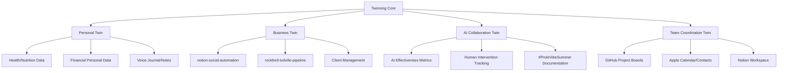

# Twinning Integration Strategy
*Based on Phase 0 Research Findings - July 22, 2025*

## Executive Summary
Based on comprehensive analysis of toilville's current ecosystem, **Twinning emerges as the missing central coordination platform** that connects all existing projects under the #ProleVibeSummer experiment umbrella. Rather than being a separate initiative, Twinning should serve as the **"digital twin" orchestration layer** that enables AI-human collaboration across the entire toilville ecosystem.

## Key Findings from Research

### 1. Current Toilville Ecosystem Status
**Active Projects Requiring Integration:**
- **notion-social-automation**: Claude AI content generation, multi-platform publishing
- **rockford-toilville-pipeline**: Data intelligence, contact processing (64.3 contacts/second)  
- **DUYinoboy**: Audio/creative tools (currently backlogged)
- **code-of-conduct**: Community standards and practices

**Integration Gaps Identified:**
- No central coordination platform between projects
- Manual project board management across repositories
- Disconnected toolsets and workflows
- Need for unified AI collaboration metrics

### 2. #ProleVibeSummer Experiment Alignment
**Perfect Strategic Fit:**
- **Timeline**: Experiment in active execution phase
- **Goal**: Test AI-only business operations for one week
- **Philosophy**: "Let algorithms toil while humans vibe"
- **Technical Need**: MCP ecosystem infrastructure (15% complete)

**Twinning's Role in Experiment:**
- Central orchestration platform for all AI tools
- Real-time collaboration effectiveness tracking
- Integration hub for MCP servers (Notion, Gmail, Apple, etc.)
- Digital twin of business operations

### 3. Technical Architecture Requirements
**MCP Integration Priority:**
- Notion MCP ✅ (already integrated via toolsets.jsonc)
- Apple MCP ✅ (calendar, contacts, mail, notes)  
- Gmail MCP (planned integration)
- Filesystem MCP (infrastructure support)
- GitHub MCP ✅ (project coordination)
- Memory Graph MCP ✅ (knowledge management)

**Existing Toolset Leverage:**
- Development tools for entity relationship tracking
- GitHub management for project coordination
- Apple ecosystem for team communication
- Notion for documentation and planning

## Twinning's Strategic Position

### Core Function: "Digital Twin Orchestration"
**Twinning = Phase0.5 Toolkit + Toilville Ecosystem Integration + #ProleVibeSummer Experiment Platform**

1. **Personal Data Twin**: Health, nutrition, finance tracking (Phase0.5 components)
2. **Business Operations Twin**: Project coordination, client management, content creation
3. **AI Collaboration Twin**: Real-time effectiveness metrics, human intervention tracking
4. **Team Coordination Twin**: Cross-project communication, task management, progress tracking

### Integration with Existing Projects

#### notion-social-automation → Twinning Content Engine
- **Current**: Claude AI content processing, multi-platform publishing
- **Twinning Enhancement**: Personal data context (health, mood, activity) for content personalization
- **Integration**: Nutrition/health data influences content tone and topics

#### rockford-toilville-pipeline → Twinning Intelligence Layer  
- **Current**: Contact intelligence, 64.3 contacts/second processing
- **Twinning Enhancement**: Personal health/activity correlation with business metrics
- **Integration**: Pipeline triggers based on personal energy levels and schedule optimization

#### DUYinoboy → Twinning Creative Module
- **Current**: Audio/creative tools (backlogged)
- **Twinning Enhancement**: Health data drives creative output timing and intensity
- **Integration**: Music creation scheduled around peak creative energy periods

## Implementation Strategy

### Phase 0.5 Component Mapping to Toilville Ecosystem

#### Self-Hosted Infrastructure → Business Infrastructure
- **Nextcloud** → File sync for team collaboration
- **Prometheus & Grafana** → Business metrics + personal health metrics
- **Firefly III** → Business finance + personal finance correlation
- **InfluxDB** → Combined personal health + business performance data
- **Local LLMs** → Private AI processing for sensitive business/personal data

#### Data Integration Opportunities
1. **Health → Productivity Correlation**: Track personal energy vs. business output
2. **Nutrition → Content Quality**: Correlate diet with content engagement metrics  
3. **Sleep → Technical Performance**: Monitor development velocity vs. sleep patterns
4. **Exercise → Client Interaction**: Track fitness data vs. client satisfaction scores

### Technical Architecture

#### Central Orchestration Layer

## Immediate Next Steps

### Phase 0.6: Update Twinning Scope
**New Scope Definition:**
- **Primary**: Digital twin orchestration platform for #ProleVibeSummer
- **Secondary**: Personal productivity optimization through data correlation
- **Tertiary**: Self-hosted infrastructure for privacy-focused business operations

### Phase 0.7: Align Phase0.5 Components with Active Projects
**High Priority Alignments:**
1. **Grafana Dashboards** → Business metrics visualization for #ProleVibeSummer
2. **Voice Journaling** → Real-time AI collaboration documentation  
3. **Health Data ETL** → Personal effectiveness correlation with business output
4. **Notion Integration** → Enhanced project coordination and documentation

**Medium Priority Alignments:**
1. **Finance Tracking** → Business/personal finance correlation analysis
2. **Local LLMs** → Private AI processing for sensitive business operations
3. **Nextcloud** → Team file collaboration infrastructure

### Phase 0.8: Map Current GitHub Issues to Twinning Features
**Direct Issue Mappings:**
- **"Define Project Twining Scope"** → Central orchestration platform definition
- **"Cross-Project Integration Strategy"** → Twinning as integration hub
- **"#ProleVibeSummer Documentation"** → AI collaboration effectiveness tracking
- **"NotionIntelligence Content Monitoring"** → Enhanced with personal data context

## Success Metrics for #ProleVibeSummer Integration

### AI Collaboration Effectiveness
- **Quantitative**: Iteration counts, processing speed, error rates
- **Qualitative**: Human intervention frequency, decision quality, client satisfaction
- **Comparative**: Traditional vs. AI-assisted workflow efficiency

### Personal-Business Data Correlation
- **Energy vs. Productivity**: Personal health data correlation with business output
- **Decision Quality**: Nutrition/sleep impact on strategic thinking
- **Creative Output**: Health data correlation with content engagement

### Business Impact Measurement
- **Client Satisfaction**: Maintain quality during AI-assisted operations
- **Revenue Impact**: Track business performance during experiment week
- **Team Coordination**: Effectiveness of digital twin orchestration

## Conclusion

**Twinning transforms from standalone toolkit to strategic orchestration platform**, perfectly positioned to support toilville's #ProleVibeSummer experiment while providing long-term value as a digital twin coordination system. The integration leverages all existing toolville projects while adding the missing coordination layer that enables true AI-human collaboration at scale.

**Immediate Priority**: Redefine Twinning as #ProleVibeSummer central platform and begin integration planning with existing projects.